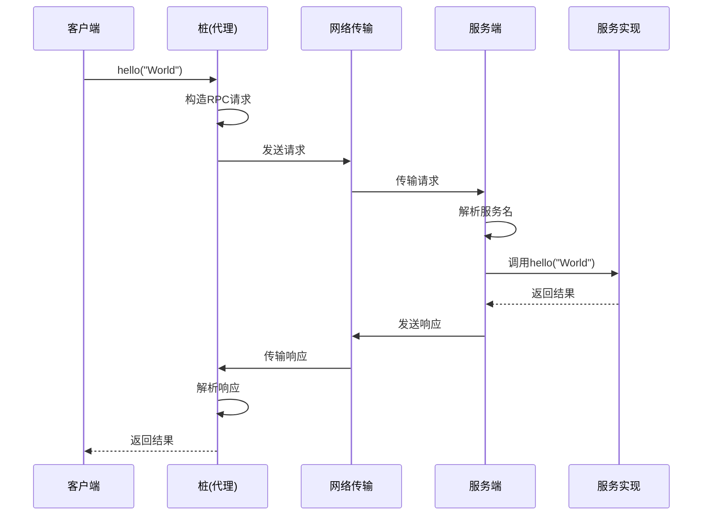

# RPC 框架的实现原理

## 概述

所有的RPC框架，它们的总体架构和实现原理都是一样的。RPC（Remote Procedure Call）的核心思想是让远程服务调用看起来像本地调用一样简单。

## 基本原理

### 传统RPC框架示例

以Dubbo为例，客户端和服务端的代码长这样：

```java
// 客户端
@Component
public class HelloClient {

    @Reference // dubbo注解
    private HelloService helloService;

    public String hello() {
      return helloService.hello("World");
    }
}

// 服务端
@Service // dubbo注解
@Component
public class HelloServiceImpl implements HelloService {

    @Override
    public String hello(String name) {
        return "Hello " + name;
    }
}
```

可以看到，无论是客户端还是服务端，除了增加了两个注解以外，和实现一个进程内调用没有任何区别。Dubbo 看起来就像把服务端进程中的实现类"映射"到了客户端进程中一样。

## 核心实现机制

### 1. 代理模式的应用

在客户端，业务代码得到的 `HelloService` 这个接口的实例其实是由 RPC 框架提供的一个代理类的实例。这个代理类有一个专属的名称，叫"**桩（Stub）**"。

### 2. 桩的工作原理

`HelloService` 的桩，同样要实现 `HelloService` 接口，客户端在调用 `HelloService` 的 `hello` 方法时，实际上调用的是桩的 `hello` 方法。在这个桩的 `hello` 方法里面，它会构造一个请求，这个请求包含两个重要的信息：

1. **请求的服务名**：在我们这个例子中，就是 `HelloService#hello(String)`，也就是说，客户端调用的是 `HelloService` 的 `hello` 方法
2. **请求的所有参数**：在我们这个例子中，就只有一个参数 `name`，它的值是"World"

然后，它会把这个请求发送给服务端，等待服务的响应。

### 3. 服务端处理流程

服务端的 RPC 框架收到这个请求之后：

1. 先把请求中的服务名解析出来
2. 找到 `HelloService` 真正的实现类 `HelloServiceImpl`
3. 调用这个实现类的 `hello` 方法，使用的参数值就是客户端发送过来的参数值
4. 将返回结果封装成响应，返回给客户端

### 4. 客户端响应处理

客户端 RPC 框架的桩收到服务端的响应之后，从响应中解析出返回值，返回给客户端的调用方。这样就完成了一次远程调用。

## 架构图



## 关键技术点

### 1. 动态代理
- 客户端通过动态代理生成服务接口的代理类
- 代理类负责将方法调用转换为网络请求

### 2. 序列化/反序列化
- 将方法参数和返回值序列化为字节流
- 支持多种序列化协议（JSON、Protobuf、Hessian等）

### 3. 网络通信
- 基于TCP/UDP协议进行网络传输
- 支持同步和异步调用模式

### 4. 服务发现
- 客户端通过注册中心查找服务地址
- 支持负载均衡和故障转移

### 5. 容错处理
- 超时机制
- 重试机制
- 熔断器模式

## 总结

RPC框架的核心就是通过代理模式、序列化、网络通信等技术，让远程调用看起来像本地调用一样简单。这种设计大大简化了分布式系统的开发复杂度，是现代微服务架构的重要基础。
